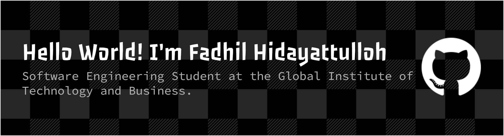

<h2 align="left">Hello World! I'm Fadhil Hidayattulloh 👋</h2>

###

<h2 align="left">About me</h2>

###

I'm a beginner in the world of coding, currently focusing on learning **Laravel** and improving my skills in web development.    I believe that learning to code is like building with LEGO — it might be tricky at first, but with patience and creativity, you can build something amazing.    📚 I'm currently learning :  - Laravel and Bootstrap Framework - PHP, HTML, CSS, and JavaScript - How to write clean and maintainable code 🎯 Goals:  - Build my first complete web application - Improve my problem-solving skills - Collaborate on open-source projects

###

<h2 align="left">I code with</h2>

###

  
  
  
  
  
  
  
  
  
  
  

###

<h2 align="left">Connect with me</h2>

###

  
  

###

<h2 align="left">My Recently Played Songs</h2>

###

  

###

<h2 align="left">Play games with me</h2>

###

  <source media="(prefers-color-scheme: dark)" srcset="https://raw.githubusercontent.com/syafiqfadhil/syafiqfadhil/output/pacman-contribution-graph-dark.svg">
  <source media="(prefers-color-scheme: light)" srcset="https://raw.githubusercontent.com/syafiqfadhil/syafiqfadhil/output/pacman-contribution-graph.svg">
  

###

<picture>
  
</picture>

###